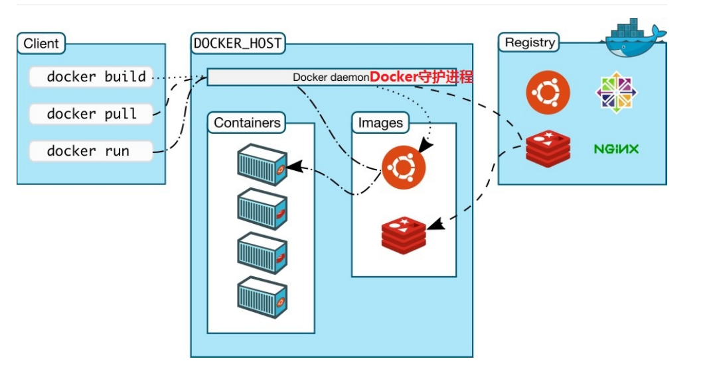

Docker 入门
===========================

# 一、Docker 解决什么问题
  开发人员可以使用  Docker 来解决 "它在我的机器可以正常运行" 的问题，它会将运行程序的相关配置打包（打包
  成一个镜像），然后直接搬移到新的机器上运行。
# 二、Docker 容器架构
  
## 2.1 Docker 客户端和服务器
* Docker是一个客户端-服务器（C/S）架构程序。Docker客户端只需要向Docker服务器或者守护进程发出请求，服务器或者守护进程将完成所有工作并返回结果。
* Docker提供了一个命令行工具和一整套RESTful API。你可以在同一台宿主机上运行Docker守护进程和客户端，也可以从本地的Docker客户端连接到运行在另一台宿主机上的远程
## 2.2 Docker 镜像(Image)
* 镜像（Image）是Docker中的一个模板。通过 Docker镜像 来创建 Docker容器，一个镜像可以创建出多个容器。镜像是由一系列指令一步一步构建出来
## 2.3 Docker 容器(Container)
* 容器（Container）是基于镜像创建的运行实例，一个容器中可以运行一个或多个应用程序（jdk+开发的java应用程序）。
*	Docker 可以帮助你构建和部署容器，你只需要把自己的应用程序或者服务打包放进容器即可。
*	我们可以认为，镜像是Docker生命周期中的构建或者打包阶段，而容器则是启动或者执行阶段。
*	一个image可以构建多个容器，一个容器可以运行一个或多个应用程序
## Docker 仓库(repository)
* 仓库（Repository）是集中存放镜像文件的场所。
*	有时候会把仓库（Repository）和仓库注册服务器（Registry）混为一谈，但并不严格区分。实际上，仓库注册服务器上往往存放着多个仓库，每个仓库中又包含了多个镜像，每个镜像有不同的标签（tag）。
*	仓库分为公有仓库（Public）和私有仓库（Private）两种。
			-> Docker公司运营的公共仓库叫做 Docker Hub （https://hub.docker.com/），存放了数量庞大的镜像供用户下载。用户可以在Docker Hub注册账号，分享并保存自己的镜像。（说明：在Docker Hub下载镜像巨慢）
			->国内的公有仓库包括阿里云 、网易云 等，可以提供大陆用户更稳定快速的访问
* 当用户创建了自己的镜像之后就可以使用 push 命令将它上传到公有或者私有仓库，这样下次在另外一台机器上使用这个镜像时候，只需要从仓库上 pull 下来就可以了。
# 三、Docker 安装卸载与启停
## 3.1 安装 Docker 服务
### 3.1.1 docker安装环境
* docker需要运行在Cenos内核版本大于3.1的系统上，使用 uname-r 查看内核版本
### 3.1.2 docker服务安装
* 卸载早期版本
		yum remove docker docker-common docker-selinux docker-engine
* 安装所需要的软件包
		yum install -y yum-utils device-mapper-persistent-data lvm2
* 设置镜像仓库(非必须)
		yum-config-manager --add-repo https://download.docker.com/linux/centos/docker-ce.repo

	设置镜像仓库可能会报错，因为国内放访问不了docker镜像的缘故，可以将镜像设置为阿里源访问
	yum-config-manager --add-repo http://mirrors.aliyun.com/docker-ce/linux/centos/docker-ce.repo
* 安装最新Docker CE
		yum install docker-ce
## 3.2 卸载 Docker 服务
* 卸载docker软件包
		yum remove docker-ce
* 删除镜像/容器等
		rm -rf /var/lib/docker
## 3.2 Docker 启用与停止
* 使用systemctl 命令，他是service和chkconfig两个命令的组合
		启动： systemctl start docker
		停止： systemctl stop docker
		重启： systemctl restart docker
		状态： systemctl status docker
		开机自启： systemctl enable docker
## 3.2 Docker 命令
		版本查看： docker version
		帮助命令： docker --help
		概要信息： docker info

# 四、Docker 镜像操作

## 4.1 列出docker下已安装的镜像
       docker images
       docker images -q  \\只显示镜像ID

## 4.2 搜索镜像
       docker search [OPTIONS] 镜像名称

       OPTIONS 选项说明
            -s 列出关注数大于指定值的镜像
                docker search -s 100 centos
            --no-trunc 显示完整的镜像描述DESCRIPTION
                docker search --no-trunc centos

## 4.3 拉取镜像
* docker pull 镜像名:标签名
      docker pull mysql:5.6

## 4.4 配置国内镜像加速器
   国情的原因，目前国内访问 Docker HUB 官方的相关镜像下载比较慢，可以使用国内的一些镜像加速器，镜像保持和官方一致，关键是速度块，推荐使用。镜像加速器其实是把官方的库文件整个拖到自己的服务器上做镜像，并定时与官方做同步。

### 4.4.1  第一种: ustc
  ustc是老牌的linux镜像服务提供者了，还在遥远的ubuntu 5.04版本的时候就在用。ustc的docker镜像加速器速度很快。ustc docker mirror的优势之一就是不需要注册，是真正的公共服务。https://lug.ustc.edu.cn/wiki/mirrors/help/docker

  步骤：

* 通过修改daemon配置文件/etc/docker/daemon.json来使用加速器,如果不存在则手动创建
      vim /etc/docker/daemon.json
* 打开文件后，按  i 字母后插入状态，在该文件中输入如下内容
      {
        "registry-mirrors": ["https://docker.mirrors.ustc.edu.cn"]
      }
* 重启docker服务，如果重启docker后无法加速，那就重新启动CentOS

### 4.4.2  第二种: 阿里云镜像, 需要注册帐号

* 注册并登陆阿里云https://www.aliyun.com/， 进入“管理控制台”后，在找到>容器镜像服务>镜像加速器>CentOs
* 通过修改daemon配置文件/etc/docker/daemon.json来使用加速器,如果不存在则手动创建
      vim /etc/docker/daemon.json
* 打开文件后，按  i 字母后插入状态，在该文件中输入如下内容
      {
        "registry-mirrors": ["https://w57n2hu2.mirror.aliyuncs.com"]
      }
* 重启docker服务，如果重启docker后无法加速，那就重新启动CentOS
      # 重载此配置文件
      systemctl daemon-reload
      # 重启 docker
      systemctl restart docker

## 4.5 删除镜像
* 删除镜像
      docker rmi 镜像ID
* 删除所有镜像  
      docker rmi 'docker images -q'
# 五 容器操作

## 5.1 查看容器
* 查看运行中的容器
      docker ps     
* 查看所有容器  
      docker ps -a   
* 查看最后一次运行的容器：
      docker ps –l
* 查看停止的容器：
      docker ps -f status=exited

## 5.2 创建与启动容器
## 5.2.1 创建容器
       docker run [OPTIONS] 镜像名:标签名
              MySQL举例：   docker run -id --name=mxg_mysql -p 33306:3306 -e MYSQL_ROOT_PASSWORD=123456 mysql:5.7
              创建了一个mysql容器，名称为mxg_mysql 端口为3306 root账号的密码为123456

       [OPTIONS] 常用参数说明
            -i 表示交互式运行容器（就是创建容器后，马上会启动容器，并进入容器 ），通常与 -t 同时使用 。
            -t 启动后会进入其容器命令行, 通常与  -i 同时使用; 加入  -it 两个参数后，容器创建就能登录进去。即分配一个伪终端
            --name 为创建的容器指定一个名称
            -d 创建一个守护式容器在后台运行，并返回容器ID； 这样创建容器后不会自动登录容器，如果加 -i 参数，创建后就会运行容器
            -v 表示目录映射, 格式为： -p 宿主机目录:容器目录，注意：最好做目录映射，在宿主机上做修改，然后共享到容器上
      -p 表示端口映射，格式为： -p 宿主机端口:容器端口

## 5.2.1 启动用与停止容器
* 启动容器
      docker start 容器名称|容器id
* 启动所有容器
      docker start `docker ps -a -q`
* 停止容器
      docker stop 容器名称|容器id
* 停止所有容器
      docker stop `docker ps -a -q`
* 强制停止
      docker kill 容器名称|容器id

## 5.2.3 创建守护式容器
* 创建（-d）并运行（-i）守护式容器命令如下（容器名称不能重复）
        docker run -id --name=mycentos2 centos:7

## 5.3 登录容器

       docker exec -it 容器名称|容器id /bin/bash

       例如： docker exec -it mysql /bin/bash   

## 5.4 拷贝宿主机与容器中的文件
* 将宿主机文件拷贝到容器内
      docker cp 要拷贝的宿主机文件或目录 容器名称:容器文件或目录
* 从容器内文件拷贝到宿主机
      docker cp 容器名称:要拷贝的容器文件或目录 宿主机文件或目录

## 5.5 数据目录挂载

我们可以在创建容器的时候，将宿主机的目录与容器内的目录进行映射，这样我们就可以通过修改宿主机某
个目录的文件从而去影响容器。使用  -v 选项

      docker run -id -v /宿主机绝对路径目录:/容器内目录 --name=容器名  镜像名

      如： docker run -id -v /opt:/opt --name=mycentos3 centos:7
      将 宿主机目录/opt 挂载 容器目录/opt

## 5.6查看容器其他信息
* 查看容器运行内部细节，比如可看容器的IP
      docker inspect mycentos2
* 查看容器IP地址
      docker inspect --format='{{.NetworkSettings.IPAddress}}' mycentos2
## 5.7 删除容器
      docker rm 容器名称 | 容器ID

## 5.8 容器保存为镜像
      容器保存为镜像: docker commit [-m="提交的描述信息"] [-a="创建者"] 容器名称|容器ID 生成的镜像名[:标签名]

      如：docker commit -m="新建镜像" -a="itplayer" 75d43f37b85d itplayer_mysql:5.5
