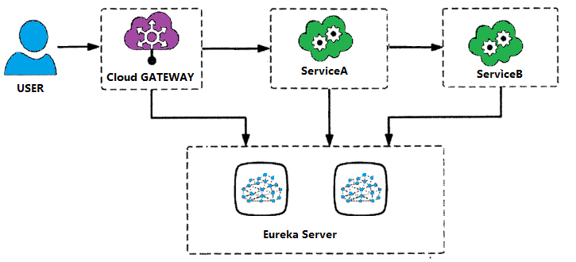
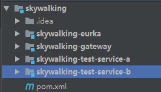

Springcloud + Skywalking + ElasticSearch 对项目实现全链路监控
==============


# 一、Skywalking
## 1、Skywalking概述
* Skywalking用于提供分布式追踪功能，从5.x版本开始，项目精华为一个完全功能的AMP系统，被用于追踪、监控和诊断分布式系统，特别是使用微服务架构、云原生或容积技术
## 2、Skywalking提供功能
* 分布式追踪和上下文传输
* 应用、实例、服务性能指标分析
* 根源分析
* 应用拓扑图分析
* 应用和服务依赖分析
* 慢服务检测
* 性能优化
## 3、Skywalking主要特性
* 多语言探针或者类库
      java自动探针，追踪和监控程序，无需修改源码
      社区提供的语言探针：.NET Core、Node.js
* 多种后端存储：ElasticSearch,h2,Mysql
      支持OpenTrancing： java自动探针和OpenTrancing API协同工作
* 轻量级、完善的后端和服务的告警
* 现代化Web UI
* 日志集成
* 应用、实例和服务的告警
* 支持接收其他追踪器数据格式
      ZipKin Josn，Thrift,Protobuf v1和v2格式，由OpenZipKin库提供
      Jaeger采用ZipKin Thrift或者Json v1/v2格式
## 4、Skywalking整体结构
  Skywalking由四部分组成，主要包括collector、agent、web、storage
* collector : 主要对数据进行分析和聚合
* agent ： 探针，主要用于采集数据，并上报数据
* web ： 主要提供UI，展示分析后的数据
* storage ： 存储仓库，数据分析存储agent采集的数据
## 5、Skywalking整体数据流向
   应用使用非入侵性的Agent形式介入，Agent采集数据并转化为SkyWalking Trace数据协议，通过HTTP或者gRPC发送到collector，collector对手机到的数据进行分析和聚合，最后存储到Stroage（通常使用ElasticSearch或者H2），WEB UI通过Http+GrahQL进行数据获取展示
# 二、Spring Cloud与Skywalking整合
## 1、服务说明
   
## 2、项目环境说明
* spring cloud
      版本： Finchley.SR1
* ElasticSearche(下文简称ES)：
      版本：elasticsearch-6.8.1
      下载地址：https://www.elastic.co/cn/downloads/past-releases
* Skywalking：
      版本：apache-skywalking-apm-6.2.0
      下载地址：http://skywalking.apache.org/downloads/
      如需使用5.x下载地址：https://archive.apache.org/dist/incubator/skywalking/

* 注意： es如果使用的5.x，则skywalking也应该切到5.x版本使用
## 3、构建项目环境
    项目结构:

  
### a、顶层项目Skywalking
* pom.xml引入Springboot：
    ```xml
    <parent>
      <groupId>org.springframework.boot</groupId>
      <artifactId>spring-boot-starter-parent</artifactId>
      <version>2.0.6.RELEASE</version>
    </parent>
    ```
* pom.xml引入Springcloud：
  ```xml
    <dependencyManagement>
         <dependencies>
             <dependency>
                 <groupId>org.springframework.cloud</groupId>
                 <artifactId>spring-cloud-dependencies</artifactId>
                 <version>Finchley.SR1</version>
                 <type>pom</type>
                 <scope>import</scope>
             </dependency>
         </dependencies>
     </dependencyManagement>
  ```
### b、注册中心 skywalking-eurka：
* pom.xml引入Springboot的webstarter：
  ```xml
    <dependency>
       <groupId>org.springframework.boot</groupId>
       <artifactId>spring-boot-starter</artifactId>
     </dependency>
   ```
* pom.xml引入eureka-server：
   ```xml
     <dependency>
       <groupId>org.springframework.cloud</groupId>
       <artifactId>spring-cloud-starter-netflix-eureka-server</artifactId>
     </dependency>
    ```
* application.yml配置服务信息和eureka-server的配置信息：
    ```yml
      server:
        port: 8761
      spring:
        application:
          name: skywalking-eurka
      eureka:
        client:
          register-with-eureka: false #本机是否启用eureka客户端，eureka集群时候开启
          fetch-registry: false
          service-url:
            defaultZone: http://localhost:8761/eureka #服务注册地址
    ```
* 项目启动类：
    ```java
      @SpringBootApplication
      @EnableEurekaServer
      public class UnifiedEurekaApplication extends SpringBootServletInitializer {

          public static void main(String[] args) {
              SpringApplication.run(UnifiedEurekaApplication.class, args);
          }

      }
    ```
### c、服务提供者：skywalking-test-service-b
* pom.xml引入Springboot的webstarter：
  ```xml
    <dependency>
       <groupId>org.springframework.boot</groupId>
       <artifactId>spring-boot-starter</artifactId>
     </dependency>
   ```
* pom.xml引入eureka-client：
   ```xml
     <dependency>
       <groupId>org.springframework.cloud</groupId>
       <artifactId>spring-cloud-starter-netflix-eureka-client</artifactId>
     </dependency>
    ```
* application.yml配置服务信息和eureka-server的配置信息：
    ```yml
      server:
        port: 9992
      spring:
        application:
          name: skywalking-walking-service-b
      eureka:
        client:
          serviceUrl:
            defaultZone: http://localhost:8761/eureka  #注册地址
        instance:
        leaseRenewalIntervalInSeconds: 10
        health-check-url-path: /actuator/health
        prefer-ip-address: true
        instance-id: ${spring.application.name}:${spring.cloud.client.ip-address}:${spring.application.instance_id:${server.port}} #
        metadata-map:
          zone: ABC      # eureka可以理解的元数据
          lilizhou: BBC  # 不会影响客户端行为
        lease-renewal-interval-in-seconds: 5 #续约更新时间间隔（默认30秒）
        lease-expiration-duration-in-seconds: 90    # 续约到期时间（默认90秒）
    captcha:
      time: 600
    feign:
      hystrix:
        enabled: true
    ```
* 提供对外接口BserviceControler：
    ```java
      @RestController
      @RequestMapping
      public class BserviceController {

          @GetMapping("/serverB")
          public String test(){
              return "success";
          }

      }
    ```
* 项目启动类：
    ```java
    @SpringBootApplication
    @EnableEurekaClient
    public class ServiceAlicationBmodel extends SpringBootServletInitializer {

        public static void main(String[] args) {
            SpringApplication.run(ServiceAlicationBmodel.class, args);
        }

    }
    ```
### d、服务消费者：skywalking-test-service-a
* pom.xml引入Springboot的webstarter：
  ```xml
    <dependency>
       <groupId>org.springframework.boot</groupId>
       <artifactId>spring-boot-starter</artifactId>
     </dependency>
   ```
* pom.xml引入eureka-client：
   ```xml
     <dependency>
       <groupId>org.springframework.cloud</groupId>
       <artifactId>spring-cloud-starter-netflix-eureka-client</artifactId>
     </dependency>
    ```
* pom.xml引入feignAPi：
    ```xml
      <dependency>
           <groupId>org.springframework.cloud</groupId>
           <artifactId>spring-cloud-starter-openfeign</artifactId>
       </dependency>Elasticsearch 是一个分布式可扩展的实时搜索和分析引擎,一个建立在全文搜索引擎 Apache Lucene(TM) 基础上的搜索引擎.当然 Elasticsearch 并不仅仅是 Lucene 那么简单，它不仅包括了全文搜索功能，还可以进行以下工作:

分布式实时文件存储，并将每一个字段都编入索引，使其可以被搜索。
实时分析的分布式搜索引擎。
可以扩展到上百台服务器，处理PB级别的结构化或非结构化数据。
    ```
* application.yml配置服务信息和eureka-server的配置信息：
    ```yml
      server:
        port: 9991
      spring:
        application:
          name: skywalking-walking-service-a
      eureka:
        client:
          serviceUrl:
            defaultZone: http://localhost:8761/eureka  #注册地址
        instance:
        leaseRenewalIntervalInSeconds: 10
        health-check-url-path: /actuator/health
        prefer-ip-address: true
        instance-id: ${spring.application.name}:${spring.cloud.client.ip-address}:${spring.application.instance_id:${server.port}} #
        metadata-map:
          zone: ABC      # eureka可以理解的元数据
          lilizhou: BBC  # 不会影响客户端行为
        lease-renewal-interval-in-seconds: 5 #续约更新时间间隔（默认30秒）
        lease-expiration-duration-in-seconds: 90    # 续约到期时间（默认90秒）
    captcha:
      time: 600
    feign:
      hystrix:
        enabled: true
    ```
* 编写ServiceBClient用于调用服务提供者的API：
    ```java
      @FeignClient(value = "skywalking-walking-service-b",fallback = ServiceHistrx.class )
      public interface ServiceBClient {

          @GetMapping("/serverB")
          String test();

      }

      ========================== ServiceHistrx ============================

      @Component
      public class ServiceHistrx implements ServiceBClient {

          @Override
          public String test() {
              return "erro";
          }

      }
    ```
* 编写AserviceController用于A服务提供测试接口:
    ```java
      @RestController
      @RequestMapping
      public class AserviceController {
          @Autowired
          ServiceBClient serviceBClient;

          @RequestMapping("/serverA")
          public String test(){
              String test = serviceBClient.test();
              return test;
          }
      }
    ```
* 编写启动类：
    ```java
        @SpringBootApplication
        @EnableFeignClients
        @EnableEurekaClient
        public class ServiceAlicationAmodel extends SpringBootServletInitializer {

            public static void main(String[] args) {
                SpringApplication.run(ServiceAlicationAmodel.class, args);
              }
        }
    ```
### e、服务网关：springcloud_gateway
* pom.xml引入sevlet api：
    ```xml
      <dependency>
         <groupId>javax.servlet</groupId>
         <artifactId>javax.servlet-api</artifactId>
      </dependency>
    ```
* pom.xml引入gateway：
    ```xml
      <dependency>
          <groupId>org.springframework.cloud</groupId>
          <artifactId>spring-cloud-starter-gateway</artifactId>
      </dependency>
    ```
* pom.xml引入eureka：
    ```xml
      <dependency>
         <groupId>org.springframework.cloud</groupId>
         <artifactId>spring-cloud-starter-netflix-eureka-client</artifactId>
     </dependency>
    ```
* application.yml配置服务信息和eureka-server的配置信息：
    ```yml
    server:
      port: 9990
    spring:
      application:
        name: skywalking-gateway
      cloud:
        refresh:
          refreshable: none
        gateway:
          discovery:
            locator:
              enabled: true
          routes:
            - id: service-a
              uri: lb://skywalking-walking-service-a
              predicates:
                - Path=/a/**
              filters:
                - StripPrefix=1
            - id: service-b
              uri: lb://skywalking-walking-service-b
              predicates:
                - Path=/b/**
              filters:
                - StripPrefix=1
      jackson:
        time-zone: GMT+8
        date-format: yyyy-MM-dd HH:mm:ss
    eureka:
      client:
        serviceUrl:
          defaultZone: http://localhost:8761/eureka  #注册地址
    ```
* 启动类：
    ```java
      @SpringBootApplication
      @EnableEurekaClient
      public class WalkingGateWayApplication extends SpringBootServletInitializer {

          public static void main(String[] args) {
              SpringApplication.run(WalkingGateWayApplication.class, args);
          }         
      }
    ```
### e、检查项目信息
* 依次启动eureka，gateway，serviceA， serviceB
* 登录Eureka管理页面检查服务注册成功情况
* 调用网关ip:端口/a/serviceA，看调用链路是否正常


# 三、ES和Skywalking配置

## ES配置
* 下载 elasticsearch-6.8.1，下载地址：https://www.elastic.co/cn/downloads/past-releases
* 解压

## 安装
