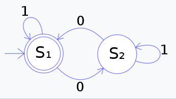

DFA(Deterministic Finite Automaton)算法
================================================

## 简介
  Deterministic Finite Automaton,即确定有穷自动机。其特征为：有一个有限状态集合和一些从一个状态通向另一个状态的边，每条边上标记有一个符号，其中一个状态是初态，某些状态是终态。但不同于不确定的有限自动机，DFA中不会有从同一状态出发的两条边标志有相同的符号；

  简单点说就是，它是是通过event和当前的state得到下一个state，即event+state=nextstate。理解为系统中有多个节点，通过传递进入的event，来确定走哪个路由至另一个节点，而节点是有限的

## 基础结构
  DFA算法结构
  * 一个费控有限的状态集合 Q
  * 一个输入字母表Σ（费控有限字符集合）
  * 一个专一函数个转移函数δ：Q × Σ → Q
  * 一个开始状态 s ∈ Q
  * 一个接受状态的结合F ⊆ Q

  举例：
        δ（q,e）=p, (p,q ∈ Q, e ∈ Σ)
        表示:Q集合中的状态q，在输入e后，状态改变为了 Q集合中的p， 同时未输入前F 为{q}，状态变更后F为{p}
## 扩展转移函数
扩展转移函数：
δ*： Q  ×  Σ* → Q
扩展转移函数递归：
δ*(q,uv) = δ*(δ*(q,v), v);其中 u,v ∈ Σ

## 例子
* 条件
  确定有限动态机器 A = （Q，Σ，δ，s，F）
  Q={S1，S2}
  Σ={0,1}
  s=S1
  F={S1}
* 转移表
      状态\输入值     0   1
        S1        	S2 S1
        S2	        S1 S2

    S1输入值集合中有基数个0，S2表示输入值集合中有偶数个0
    可以看见当输入0 的时候会输入值结合中的0的奇偶性变化，涉及到状态变化
    输入1的时候，奇偶性未发生变化，故不会引起状态变化
* 对应的函数为
        δ*(S1,0)=S2
        δ*(S1,1)=S1
        δ*(S2,0)=S1
        δ*(S2,0)=S2
* 对应图形说明

## 其他高级说明
   参考维基百科  https://zh.wikipedia.org/wiki/%E7%A1%AE%E5%AE%9A%E6%9C%89%E9%99%90%E7%8A%B6%E6%80%81%E8%87%AA%E5%8A%A8%E6%9C%BA

## 算法应用

    目前针对该算法，我这边实现了2个应用方式，分别是 敏感词过滤 和 用户URL权限拦截的控制

### 敏感词过滤

### URL权限拦截
